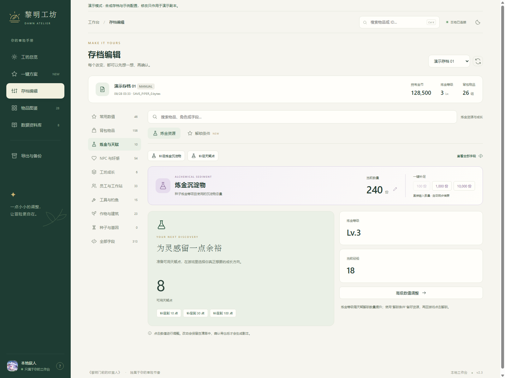
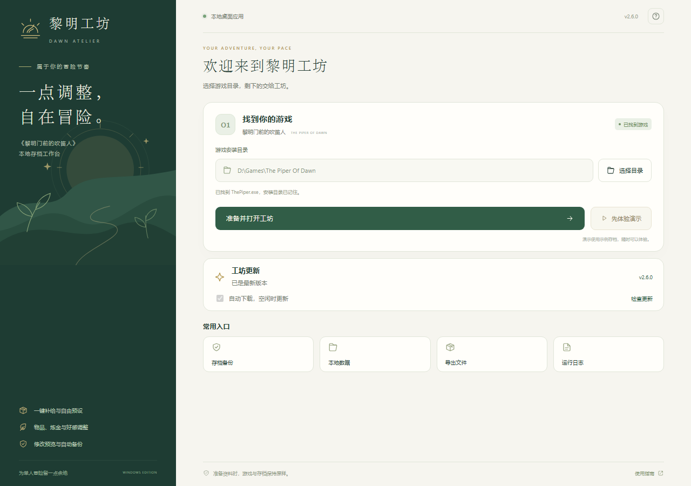
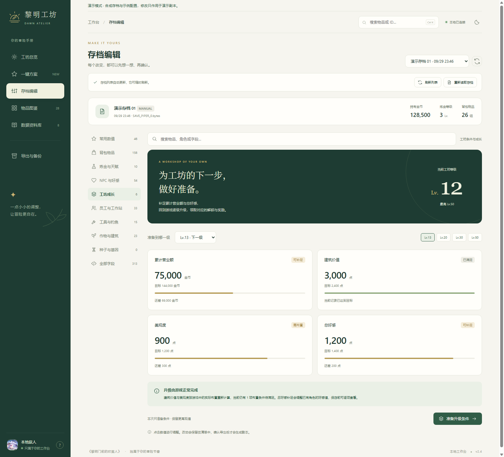

<div align="center">


# 黎明工坊 · Dawn Atelier

**把重复的准备工作交给预设，把时间留给冒险。**

**《黎明门前的吹笛人》（The Piper of Dawn）本地存档工具**，支持一键补给、炼金调整、好感提升、农具升级和自动备份。

[下载 Windows 桌面版](https://github.com/X-Zero-L/dawn-atelier/releases/latest) · [功能介绍](#功能介绍) · [使用方法](#使用方法) · [观看演示](#观看演示) · [常见问题](#常见问题)

</div>

[](https://github.com/X-Zero-L/dawn-atelier/releases/latest/download/dawn-atelier-demo.mp4)

## 功能介绍

### 选一套方案，按自己的节奏玩

内置 **10 套方案、19 项可组合操作**。目标数量可以调整，常用组合可以保存为自己的方案，也能导出分享。

| 方案 | 帮你准备什么 |
| --- | --- |
| 超级补给 | 按各自上限补满可堆叠物品，补齐缺少的常规物品与普通种子 |
| 轻松开荒 | 10 万金币、30 份已有种子、10 点天赋 |
| 田园日常 | 99 份种子与肥料、4 级农具，让杂物更容易清理 |
| 富足经营 | 100 万金币、99 份日常物品，恢复员工 SAN |
| 炼金准备 | 99 份材料与种子、1000 份炼金沉淀物、30 点天赋 |
| 街坊好友 | 将 NPC 好感提升到各自第 5 档，恢复今日送礼次数 |
| 好感拉满 | 按每位已有角色各自的最高档位，自动算出并补足所需好感 |
| 充实储备 | 1000 万金币、999 份日常物品、1000 枚筹码 |
| 炼金解锁准备 | 按前置顺序补齐金币、天赋点和解锁材料，回游戏点击解锁 |
| 工坊升级准备 | 补足累计营业额与总好感，查看建筑和美观度缺口，回游戏逐级升级 |

补给保留更高的现值，并遵守每种物品的堆叠上限。**超级补给还能补齐尚未拥有的常规物品**，包括铜铁金锭、矿石、材料、商品、普通种子和员工种子。需要特殊记录的物品会跳过，具体结果可以在保存前查看。

### 一键超级补给

打开“一键方案”，点击顶部的 **一键补满全部**。也可以自定义每种目标数量，例如 99、999 或 10000；上限不足的物品会按自身上限处理。

当前版本可补齐 **332 种常规物品**，支持补给 **430 种可堆叠配置**。已有杂交种子可以补数量，尚未拥有的杂交种子需要来源与基因数据，会列入未新增清单。独特剧情道具、隐藏计数和建筑解锁物品不会直接塞进背包。

只缺建造材料时，可以使用单项 **矿石与金属锭**。普通“背包补给”和“材料储备”也已覆盖铜锭等材料。


<details>
<summary>查看全部方案</summary>


</details>

### 想改哪一项，就直接改哪一项

- **背包补给**：查看物品名称、数量和上限，单项补足、批量配置或补齐缺少的常规物品。
- **炼金资源**：调整天赋点和沉淀物，支持自定义数量与快捷补足。
- **NPC 好感**：查看每位角色的当前值、上限和缺口，支持单人拉满、全员拉满与逐档提升。
- **农具升级**：直接选择等级，预览对应的作用范围。
- **员工状态**：恢复 SAN，保留特殊员工的原有设定。
- **物品图鉴**：搜索名称、用途或 ID，收藏常用物品。
- **修改清单**：查看改动前后数值，逐项取消或撤销上一组操作。
- **自动备份**：保存前备份原档，随时下载修改前的进度。

<table>
  <tr>
    <td width="50%"><p align="center">整理背包，备足日常物品</p></td>
    <td width="50%"><p align="center">直接调整炼金沉淀物与天赋点</p></td>
  </tr>
  <tr>
    <td><p align="center">查看好感，提升到下一档</p></td>
    <td><p align="center">选择工具等级和作用范围</p></td>
  </tr>
</table>

支持深色模式与窄屏布局。`Ctrl+K` 搜索物品，`Ctrl+Z` 撤销上一步修改。

## 下载安装

### Windows 一键包

**Windows 10 / 11 64 位，无需安装 Python。**

1. 从 [最新版本](https://github.com/X-Zero-L/dawn-atelier/releases/latest) 下载 **`DawnAtelier-2.4.1-windows-x64.zip`**。
2. 完整解压，双击 **`DawnAtelier.exe`**。
3. 确认自动找到的游戏目录，或点击 **选择游戏**。
4. 点击 **准备并打开工坊**。首次准备完成后，后续可直接进入。

工作台会在独立窗口内打开。尚未安装游戏时，也可以点击 **体验演示**。

请保留 EXE 旁边的 `_internal` 文件夹。独立窗口使用 Microsoft WebView2；电脑缺少该组件时，会提供浏览器模式和官方安装入口。



已核对游戏资源版本 **`2026-09-29-717`**、`2026-09-28-1042` 和 `2026-09-25-1016`。**v2.4.1 修复了 9 月 29 日游戏更新后无法准备、进入工坊的问题**；旧版用户请更新后重新准备。补丁日期变化不会直接阻止使用，程序会检查存档结构、序列化代码和资源配置。详细信息见 [兼容性说明](docs/compatibility.md)。

### 从源码运行

需要 Python 3.11+。通过 Git 获取源码：

```powershell
git clone https://github.com/X-Zero-L/dawn-atelier.git
cd dawn-atelier
```

在项目目录中运行：

```powershell
python -m venv .venv
.\.venv\Scripts\python.exe -m pip install -r requirements.txt
.\.venv\Scripts\python.exe prepare.py --game-dir "D:\Steam\steamapps\common\The Piper Of Dawn"
.\.venv\Scripts\python.exe launch.py
```

把 `--game-dir` 后的路径换成你的游戏目录，该目录应包含 `ThePiper.exe`。能自动找到 Steam 安装时，可以省略这一参数。

浏览器会打开 **`http://127.0.0.1:8766`**。首次准备完成后，下次只需要运行：

```powershell
.\.venv\Scripts\python.exe launch.py
```

### 源码演示模式

尚未准备游戏数据，也可以用示例存档体验操作：

```powershell
python launch.py --demo
```

演示模式不会访问你的游戏存档。可以查看图鉴、组合预设和导出演示副本。

## 使用方法

1. **在游戏里保存进度。** 回到工坊，选择刚保存的存档。
2. **选择方案或调整单项。** 改动会先加入清单。
3. **查看修改清单。** 确认原值、目标值，取消不需要的项目。
4. **保存修改。** 可以导出副本；也可以退出游戏后，点击“备份并直接应用”。
5. **重新进入游戏读档。** 读取刚修改的那一份存档。

软件打开后仍可在游戏中保存新的进度。编辑页与一键方案页会自动更新存档列表，下拉框获得焦点或展开时也会刷新。点击 **重新读取存档** 即可读取当前文件的最新内容。

发现游戏中的新进度时，页面会提示重新读取。已有修改会保留在对应旧进度的草稿中；新进度不会自动套用旧修改，需要按当前内容重新配置。

桌面版可从顶部的文件夹入口找到导出与备份，默认保存在 `%LOCALAPPDATA%\DawnAtelier\data\game\`；源码版保存在项目的 `data/game/` 下。选择导出方式时，需要先退出游戏，再用副本替换对应的游戏存档文件。

### 修改炼金沉淀物

进入 **存档编辑 → 炼金与天赋**，点击“炼金沉淀物”的数量即可修改；也可以快捷补足到 **100、1000、10000**。

“炼金准备”方案默认补足到 1000。自定义方案中可单独选择“炼金沉淀物”，输入自己的目标。

### 准备炼金解锁和工坊升级

**炼金与天赋 → 解锁条件** 可以按所选天赋和前置顺序备齐金币、点数、材料；**工坊成长** 可以补足营业额、总好感，并查看建筑与美观度缺口。

保存、重新读档后，在游戏原有界面点击解锁或逐级升级。对应配方、建筑、能力与奖励由游戏处理。剧情、实际布置和原料“曾获得”记录仍需在游戏内满足。详见 [成长准备说明](docs/progression.md)。



### 一键满好感

进入 **存档编辑 → NPC 与好感**，点击 **一键全部拉满**，或在角色卡片中点击 **拉满**。工坊会按当前游戏配置计算每位角色的目标，不把所有角色设成同一个数字。

当前已核对配置包含 **Lv.10 / 2900** 和 **Lv.12 / 4400** 两种最高数值档位。已有值更高时保留，保存前可查看每人的修改。剧情门槛、对话与好感奖励仍需回游戏完成；数值达到上限后，游戏显示的等级可能仍受剧情限制。

### 保存自己的方案

在“一键方案”中点击“自定义方案”，勾选操作并调整目标，保存到“我的方案”。方案支持 JSON 导入和导出，方便换浏览器或分享给其他玩家。

尚未保存的修改会自动保留为草稿。如果游戏保存了新的进度，需要重新读取存档，再生成对应的修改清单。

### 恢复修改前的进度

进入 **导出与备份 → 最近操作与原档**，下载对应操作前的原档。退出游戏后，将它放回游戏存档目录，再进入游戏读取。

原档和操作记录保存在数据目录的 `backups/` 下。桌面版顶部可直接打开备份文件夹。建议保留这些文件，直到确认修改后的进度符合预期。

### 更新桌面版

关闭工坊，下载新版一键包并完整解压，双击新的 `DawnAtelier.exe`。游戏路径、准备资料、导出和备份保存在用户数据目录中，更新程序后仍可继续使用。

首次从源码版切换到桌面版，需要在启动器中重新准备游戏资料。原有源码目录中的备份仍保留在原处。

## 观看演示

[](https://github.com/X-Zero-L/dawn-atelier/releases/latest/download/dawn-atelier-demo.mp4)

**[观看完整演示](https://github.com/X-Zero-L/dawn-atelier/releases/latest/download/dawn-atelier-demo.mp4)**，了解超级补给、铜铁金锭补齐、炼金沉淀物调整，以及保存前的修改预览。

## 常见问题

**找不到游戏目录？** 桌面启动页点击“选择游戏”，选择包含 `ThePiper.exe` 的目录。源码版可运行 `prepare.py --game-dir "你的游戏目录"`。

**双击后提示缺少文件？** 请先完整解压 ZIP，并保留 `_internal` 文件夹，再打开 EXE。

**没有弹出独立窗口？** 缺少 WebView2 时会使用浏览器模式，可通过启动器中的官方入口安装组件。浏览器模式使用期间请保持启动器开启。

**端口被占用？** 使用 `python launch.py --port 8767`，换一个本地端口。演示模式也支持这个参数。

**为什么有些操作被跳过？** 补足目标已经满足、物品不能堆叠，或记录具有特殊关联时，预设会保留原状并说明原因。超级补给会新增支持的缺失物品；普通补给只调整已有记录。

**为什么不能直接应用？** 请先退出游戏。演示模式下只能导出演示副本。

**金币和沉淀物要乘倍率吗？** 都直接填写想要的数量，工坊会处理存储单位。

**超级补给会完成剧情或解锁全部建筑吗？** 不会。它处理背包物品与必要的种子关联，剧情、奖励和建筑解锁仍由游戏处理。未拥有的杂交种子不会自动生成。

**更新游戏后还能使用吗？** 可以先在启动设置中重新准备。资源补丁和关键结构一致的版本可继续使用；检测到序列化变化时会明确提示需要适配。

## 使用范围

本工具在本机运行。修改前可预览，保存前会备份，并检查游戏是否已保存了更新的进度。

各项预设尚未逐一完成游戏内效果验证；首次使用某项功能时，建议导出副本并保留原档。关于游戏版本和已知限制，参阅 [兼容性说明](docs/compatibility.md)。

这是独立工具，与游戏开发者没有隶属关系。游戏名称与美术属于各自权利人，详见 [素材与第三方说明](NOTICE.md)。

[报告问题](https://github.com/X-Zero-L/dawn-atelier/issues) · [开发文档](docs/development.md)
