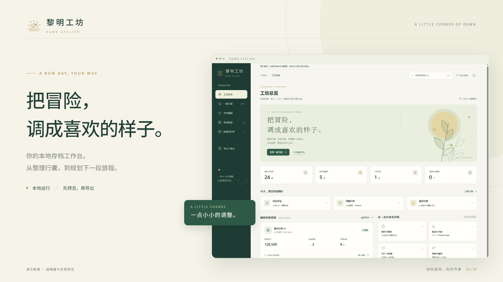
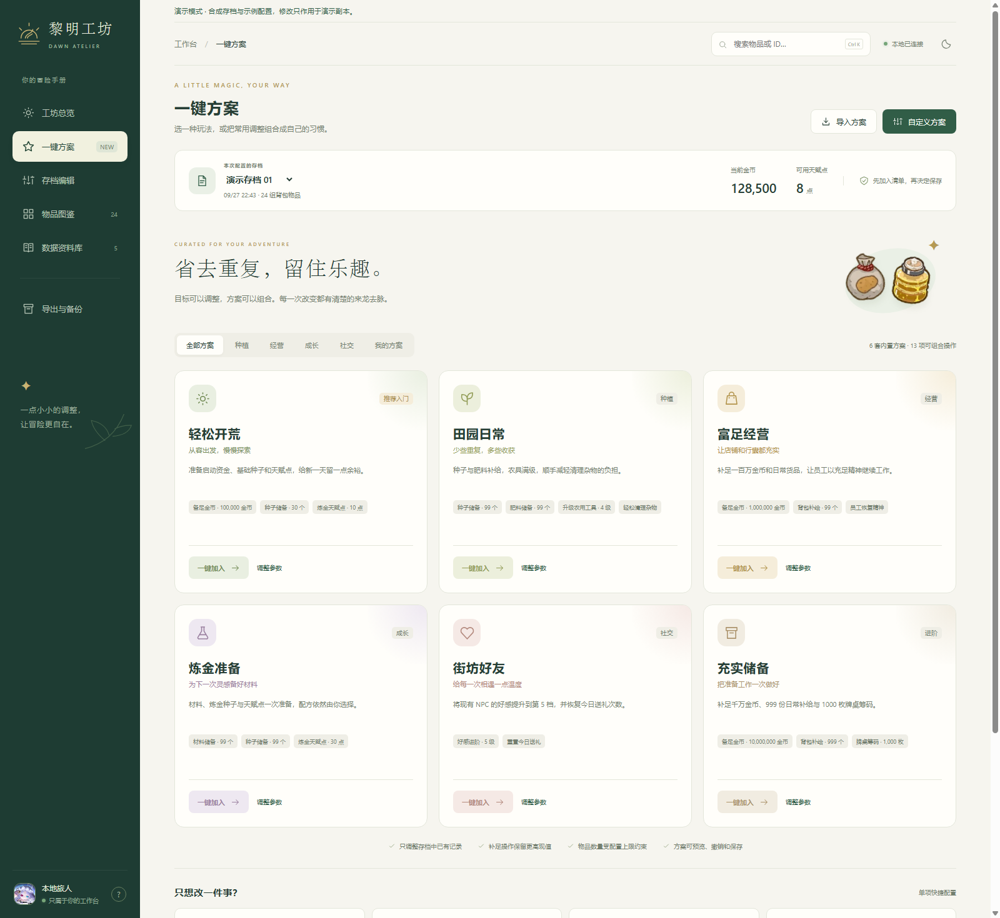
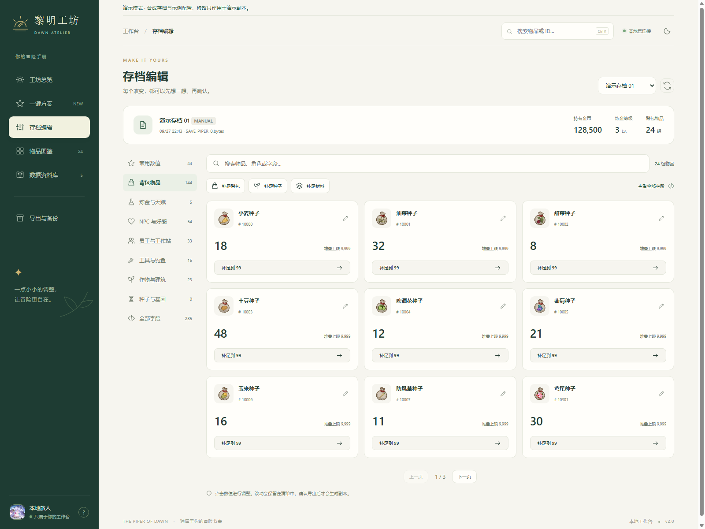
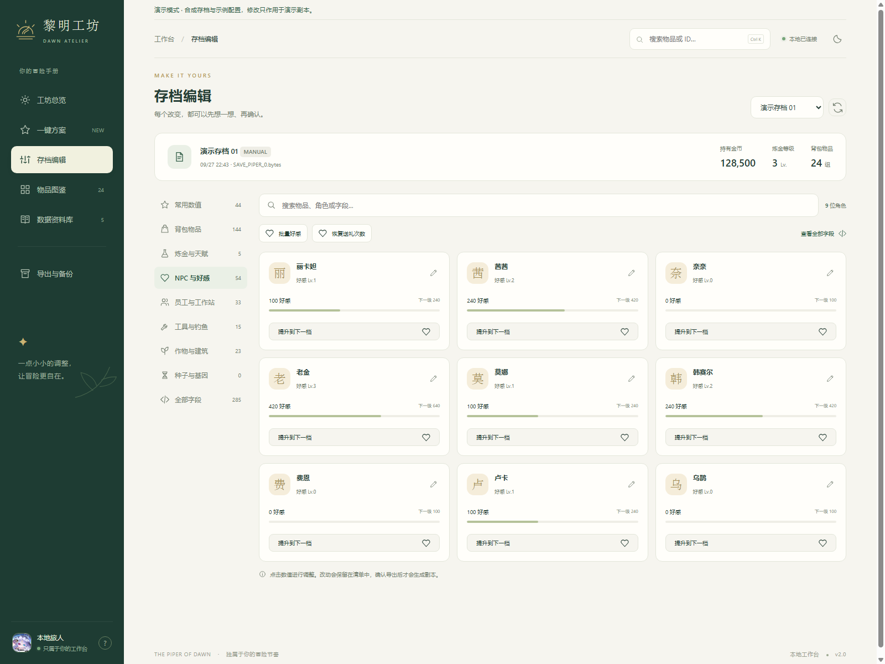
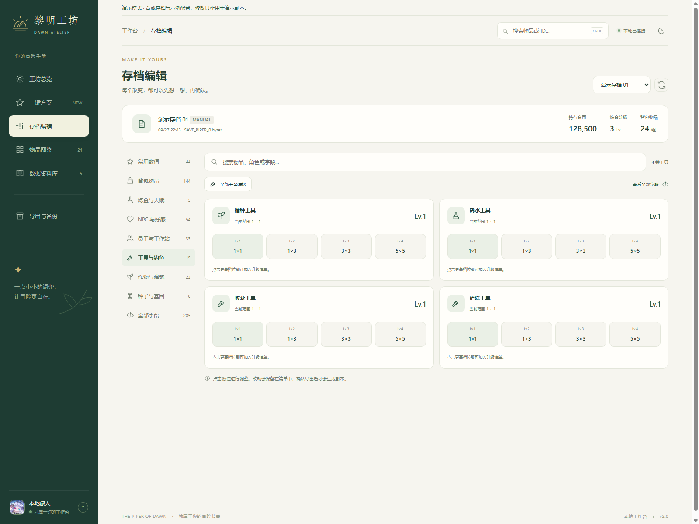
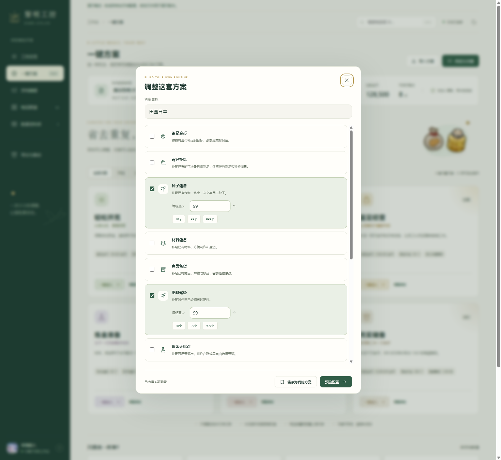
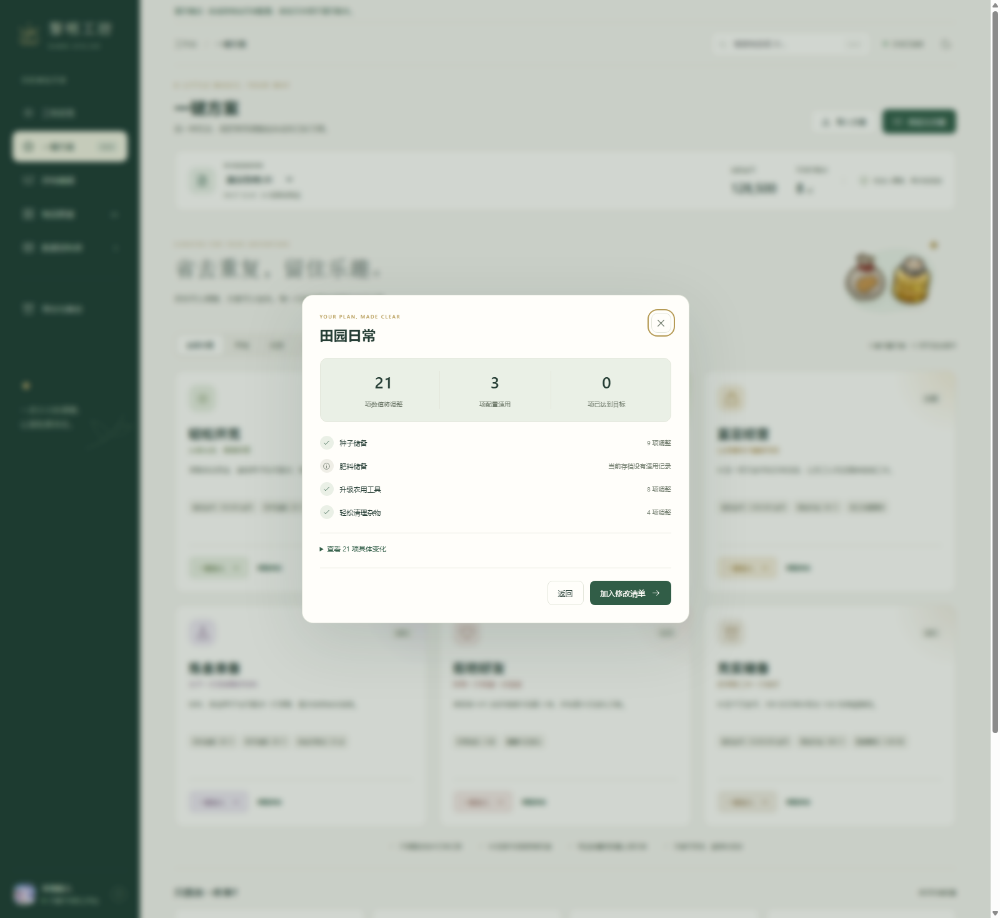

<div align="center">


# 黎明工坊 · Dawn Atelier

**把重复的准备工作交给预设，把时间留给冒险。**

The Piper of Dawn 的本地存档工作台：一键方案、物品图鉴、可审阅的修改清单与自动备份。

[快速体验](#快速体验) · [连接游戏](#连接游戏) · [功能](#功能) · [演示视频](#演示视频) · [兼容性](docs/compatibility.md)

</div>

[](https://github.com/X-Zero-L/dawn-atelier/releases/download/v2.0.0/dawn-atelier-demo.mp4)

## 功能

### 从一套方案开始

内置 **6 套方案、13 项可组合操作**。每套方案都能调整目标值、保存为自定义方案，并通过 JSON 导入或导出。

| 方案 | 默认配置 |
| --- | --- |
| 轻松开荒 | 金币补足到 10 万、已有种子补足到 30、天赋点补足到 10 |
| 田园日常 | 种子与肥料补足到 99、四类农具升到 4 级、杂物耐久降到 1 |
| 富足经营 | 金币补足到 100 万、日常物品补足到 99、员工恢复 SAN |
| 炼金准备 | 材料与种子补足到 99、天赋点补足到 30 |
| 街坊好友 | 按每个 NPC 的配置提升到好感第 5 档、重置今日收礼次数 |
| 充实储备 | 金币补足到 1000 万、日常物品补足到 999、筹码补足到 1000 |

补足操作保留更高的现值。背包补给按物品堆叠上限处理，跳过任务物品和独特道具；员工上限为 0 时保留原设定。方案预览会显示适用项、已达到目标的记录和跳过原因。

<details>
<summary>查看完整方案页面</summary>



</details>

### 每个系统都有自己的操作界面

<table>
  <tr>
    <td width="50%"><p align="center">背包数量、堆叠上限与单项补给</p></td>
    <td width="50%"><p align="center">NPC 好感档位与下一档目标</p></td>
  </tr>
  <tr>
    <td><p align="center">农具等级与作用范围直接点选</p></td>
    <td><p align="center">组合操作，保存自己的日常方案</p></td>
  </tr>
</table>

- **图鉴与资料库**：中文搜索、物品收藏、详情侧栏、配置表检索。
- **修改清单**：显示原值、目标值和修改来源；支持逐项移除与整组撤销。
- **草稿恢复**：未保存清单绑定存档名称与 SHA-256；文件变化后不套用旧草稿。
- **导出或直接应用**：两种方式都先备份。直接应用要求游戏已退出。
- **原档下载**：操作记录中可取回修改前的存档。
- **界面**：暖白与深绿主题、深色模式、430px 窄屏布局、`Ctrl+K` 搜索、`Ctrl+Z` 撤销。

## 快速体验

演示模式只需要 **Python 3.11+**，使用程序生成的合成存档和少量示例配置。

```powershell
git clone https://github.com/X-Zero-L/dawn-atelier.git
cd dawn-atelier
python launch.py --demo
```

浏览器会打开 `http://127.0.0.1:8766`。演示模式可查看预设、修改预览并导出演示副本，直接写入游戏存档的入口保持禁用。

如果端口已被占用：

```powershell
python launch.py --demo --port 8767
```

新克隆的演示界面使用内置矢量插画。README 和视频中的物品图来自本机游戏资源准备，存档数值均为合成数据。

## 连接游戏

真实存档编辑针对 **Windows 上的受支持游戏版本**。版本号及文件哈希见 [兼容性说明](docs/compatibility.md)。

```powershell
python -m venv .venv
.\.venv\Scripts\python.exe -m pip install -r requirements.txt

.\.venv\Scripts\python.exe prepare.py --game-dir "D:\Steam\steamapps\common\The Piper Of Dawn"
.\.venv\Scripts\python.exe launch.py
```

`prepare.py` 从本机安装读取资源，核对受支持版本、解码配置表，并准备界面需要的图标。游戏目录会写入被 Git 忽略的 `config.local.json`。找到 Steam 安装时可以省略 `--game-dir`。

只需要存档编辑和资料库时，可以跳过美术提取：

```powershell
python prepare.py --game-dir "D:\Steam\steamapps\common\The Piper Of Dawn" --skip-art
```

### 使用流程

1. 在游戏中保存进度，进入工坊选择对应存档。
2. 选择一键方案，或在各系统卡片中调整数值。
3. 打开修改清单，核对原值、目标值和来源。
4. 导出副本；或者退出游戏后点击“备份并直接应用”。
5. 进入游戏，读取修改后的存档。

金币直接输入界面数量，工坊会换算成游戏内部的千倍整数。工具等级显示为 1–4 级，内部存档值为 0–3。



### 数据放在哪里

| 路径 | 内容 |
| --- | --- |
| `data/game/` | 从本机游戏生成的配置、索引和资料 |
| `data/game/backups/` | 修改前的原档与操作记录 |
| `data/game/modified-saves/` | 导出的修改副本 |
| `data/demo/` | 合成演示数据、演示导出与备份 |
| `web/assets/` | 本机提取的界面插画和物品图标 |
| `config.local.json` | 本机路径设置 |

这些目录都在 `.gitignore` 中。自定义方案、物品收藏和未保存草稿保存在浏览器本地存储；需要跨浏览器迁移的方案可以导出为 JSON。

路径可通过 [config.example.json](config.example.json) 或环境变量覆盖：

| 环境变量 | 用途 |
| --- | --- |
| `PIPER_GAME_DIR` | 游戏安装目录 |
| `PIPER_SAVE_DIR` | 自定义存档目录 |
| `DAWN_DATA_DIR` | 生成数据的目录 |
| `DAWN_ASSET_DIR` | 界面图标与插画目录 |

## 演示视频

[](https://github.com/X-Zero-L/dawn-atelier/releases/download/v2.0.0/dawn-atelier-demo.mp4)

**[观看 / 下载 32 秒演示视频](https://github.com/X-Zero-L/dawn-atelier/releases/download/v2.0.0/dawn-atelier-demo.mp4)** · 1920 × 1080 · 30 fps · Remotion

视频展示预设、背包、NPC 好感、农具升级与变更预览。没有应用到实际游戏存档。Remotion 工程、依赖锁文件、字体许可与复现命令位于 [video/](video/README.md)。

## 运行方式与实现

工作台采用 Python 标准库 HTTP 服务与原生 HTML/CSS/JavaScript。网页只连接本机服务，不需要前端构建工具。资源准备使用 `cryptography` 和 Pillow；Node.js 仅用于演示视频和截图脚本。

```text
app_config.py        本机路径、演示模式与 Steam 目录发现
web_server.py        本地 API、预览、备份与应用
save_codec.py        具名字段解析与局部字节替换
presets.py           允许的预设操作和目标计算
prepare.py           本机配置与界面资源准备
demo_data.py         合成演示数据生成
schemas/             受支持版本的字段结构与枚举
web/                 网页界面和内置品牌矢量图
research/            可复现的资源读取与结构分析脚本
video/               Remotion 演示工程
docs/images/         发布截图与视频封面
```

更详细的数据流程见 [架构说明](docs/architecture.md)。

### 复现截图和视频

截图脚本需要 Node.js 22+ 和已安装的 Chrome / Edge：

```powershell
python launch.py --demo --port 8767 --no-browser
node scripts/capture-demo.mjs

cd video
npm ci
npm run assets
npm run render
```

截图脚本会检查服务确实处于合成演示模式，再启动独立的无头浏览器。视频文件生成在 `video/out/`，通过 GitHub Release 分发。

## 已确认的范围

- 受支持版本的配置提取：81 张表、97,078 行、655 种物品。
- 存档结构：137 个消息、774 个字段；配置结构与枚举随版本固定。
- 资源读取：清单、配置表行数和对应 CRC 核对。
- 界面展示：桌面、窄屏、方案编辑器、专用操作卡片和变更预览。
- 写入保护：源文件 SHA-256 核对、修改反向还原比对、备份、临时文件替换。

预设只编辑已有记录，不创建缺失实体，不代替游戏执行剧情或奖励流程。各项预设尚未逐一完成游戏内效果验证。游戏更新后应先核对兼容性，版本不匹配时数据准备会停止。

## 项目与素材

这是独立的本地工具，与游戏开发者没有隶属关系。游戏名称、美术和其他游戏资源属于各自权利人；原始游戏资源由使用者从本机安装生成，仓库提供工具源码、结构定义与展示截图。第三方字体的许可证见 [素材说明](NOTICE.md)。
