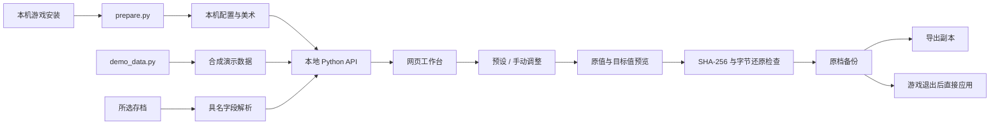

# 架构与数据边界

## 配置准备

资源读取器解析 YooAsset 清单，从本机游戏元数据恢复当前版本的解码常量，再提取配置 TextAsset。表解码后关联中文语言表，生成用于页面搜索的 JSON。界面美术按需从少量资源包读取，完整解包通过 `unpack_all.py` 单独执行。

版本结构定义只包含接口所需的字段名、类型、字段编号和枚举，游戏表数据、美术、用户存档、反汇编转储和本机路径均在生成目录中。

## 编辑

`save_codec.py` 保留消息中原始字段的字节范围。一次编辑仅替换目标值及其父消息的长度前缀。保存前执行反向替换，确认可以逐字节恢复原文件；随后再核对源文件是否仍与读取时一致。

`presets.py` 把允许的操作转换为字段变更。物品与 NPC 通过配置 ID 定位，工具通过 ID 定位，列表下标仅作为当前存档里的路径。补给预设保留更高现值。

`inventory.py` 处理超级补给的缺失物品新增。它分配唯一的物品与种子逻辑 ID，复用同配置的脱离背包种子记录，或追加配对记录。普通物品列表及种子区域均保留反向补丁，移除本次新增后必须逐字节还原编辑前的数据；新种子的正反向关联也须一致。

新增操作通过 `InventoryAdd[配置ID]` 表示，并由服务端重新核对配置、数量和是否已拥有。草稿、预览、导出、直接应用与撤销使用同一清单。杂交种子仅补已有数量，独特道具、隐藏项与解锁代理不直接新增。

## 本地服务

服务只监听 `127.0.0.1`，检查 Host。写入 API 还检查 Origin 与每次启动随机生成的请求令牌。静态文件只来自网页文件、图标目录和明确允许的下载目录。写入过程串行化，防止同一服务同时应用多个变更。

演示模式使用独立数据目录；直接应用始终禁用。UI、API、编码器和预设计算与真实模式共用。

## 浏览器状态

收藏和自定义方案保存在 localStorage。草稿按“存档名称 + 原文件 SHA-256”保存；改动历史用于当前会话的整组撤销。导入的方案只接受允许的操作名称和有界数值，不接受代码或任意字段路径。

## 媒体

`scripts/capture-demo.mjs` 只连接本机演示服务，通过独立 Chromium 配置拍摄截图。`video/` 使用固定版本 Remotion 合成演示视频，成片作为 Release 附件分发。
