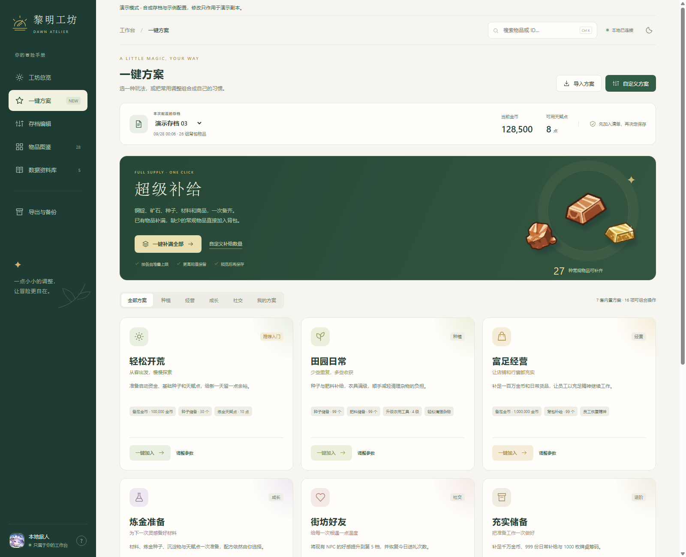
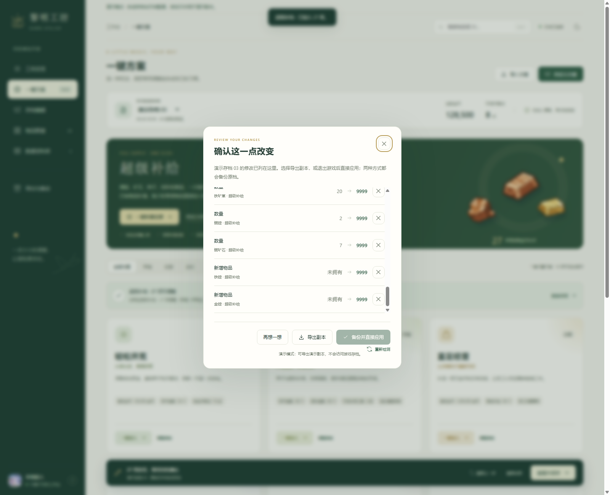

# 超级补给

## 一次备齐材料与物品

进入 **一键方案 → 超级补给**，点击“一键补满全部”。默认目标为每种 10000，实际数量按该物品堆叠上限取值：例如铜锭上限是 9999，蘑菇毒素上限是 10000。

可以先点“自定义补给数量”，填写 99、999 或其他目标。已有数量高于目标时保留，不会减少。

## 会处理哪些物品

- 已有的可堆叠物品，包括铜铁金锭、矿石、材料、商品、肥料和种子。
- 尚未拥有的常规物品，会创建新的背包记录。
- 普通作物种子、炼金种子和员工种子，会同时创建或复用所需的种子关联。
- 单独使用“矿石与金属锭”，可以只补齐建造和工具强化材料。

支持的游戏版本有 332 种可补齐的常规物品。另有 98 种杂交种子可以补已有数量，但未拥有时不会自动创建，因为它们需要来源种子、成长时间与基因数据。

独特剧情物品、隐藏物品、筹码代理和建筑解锁代理不按普通物品批量添加。

## 保存前核对清单

清单中“数量”表示补充已有物品，“新增物品”表示此前背包中没有这一种。可以逐项取消，也可以整组撤销。

确认后导出副本，或退出游戏后备份并直接应用。首次使用新增物品功能时，建议先导出副本，读档后确认背包和种子操作符合预期，并保留原档。
